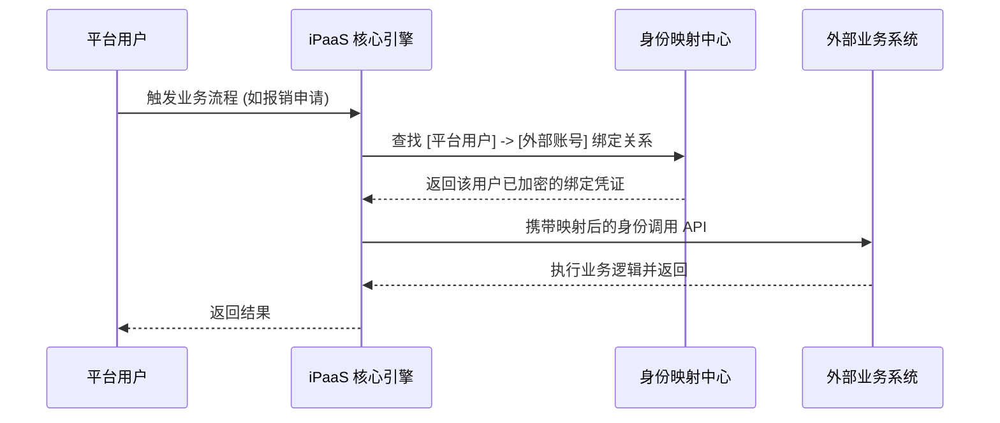

# 模拟身份认证最佳实践指南

## 1. 业务背景与价值

在现代企业集成架构中，API 调用往往需要**透传具体业务人员的身份**。例如在 ERP 中提交审批或在 CRM 中查询私有客户。**模拟身份认证（Simulated Identity Authentication）** 是 iPaaS 平台提供的核心能力，旨在通过建立平台用户与外部系统用户之间的映射关系，实现精准的身份转换。

### 核心价值：
*   **审计合规**：外部系统可真实记录操作人信息，满足审计要求。
*   **权限复用**：直接沿用业务系统的用户权限模型，减少平台侧二次开发。
*   **安全可控**：支持个人凭证独立绑定，避免系统账号（Super User）权限过大带来的安全风险。

---

## 2. 核心认证逻辑

---

## 3. 场景分析与最佳实践建议

| 场景类型 | 核心挑战 | 推荐映射策略 |
| :--- | :--- | :--- |
| **标准报销/审批** | 账号体系一致 (LDAP/SSO)。 | **同名映射**：无需配置，系统自动通过用户名匹配，维护成本最低。 |
| **敏感财务操作** | 账号体系不一致，安全性要求极高。 | **不同用户名映射**：在“提供方用户关系”中显式维护多对一映射关系。 |
| **第三方应用调用** | 外部应用调用平台，需指定身份。 | **消费方身份透传**：通过 `__userName__` 参数动态指定调用者身份。 |

---

## 4. 实施配置路径

### 4.1 管理员：配置与管理 (集成系统)
1.  **开启认证分类**：进入 `基础管理 -> 集成系统`，将目标系统的认证分类设置为 `模拟身份认证`。
2.  **标记个人认证字段**：在认证表单中，为需要用户填写的字段（如用户名、密码）设置约束属性 `personal_auth_flag:1`。
3.  **用户关系维护**：
    *   **提供方用户关系**：维护平台用户与目标系统用户的映射（若非同名）。
    *   **消费方用户关系**：配置外部调用者如何映射到平台内部用户。

### 4.2 普通用户：绑定与激活 (个人配置)
1.  **进入页面**：`接口平台 -> 基础管理 -> 个人集成映射配置`。
2.  **绑定账号**：找到对应的集成系统卡片，点击 **[绑定]** 并录入自己在该系统的凭证。
3.  **生效验证**：状态显示为“已绑定”后，相关的服务编排将自动开始使用您的身份进行调用。

> [!IMPORTANT]
> **安全提醒**：如果您的外部系统密码发生变更，请及时在平台进行【解绑】并重新【绑定】，以防接口调用因认证失败而中断。

---

## 5. 典型案例：跨系统财务审计闭环

**背景**：某公司员工在移动端发起报销，后端需通过 iPaaS 调用 SAP 接口。
**实施**：
1.  员工在 iPaaS 的“个人映射配置”中绑定其 SAP 个人账号。
2.  iPaaS 管理员开启“同名映射”策略。
3.  当员工发起请求时，iPaaS 动态提取并注入该员工的 SAP Token。
**结果**：SAP 系统内每一笔报销单的“创建人”均自动填充为真实的报销人，完美实现审计闭环。

---

## 6. 常见问题解答 (FAQ)

> [!NOTE]
> **Q：为什么在个人映射页面找不到某个系统？**
> A：请检查该集成系统的“认证分类”是否为“模拟身份认证”。

> [!TIP]
> **Q：如何确保凭证安全？**
> A：平台对所有个人绑定的凭证进行高强度 AES 加密存储，且仅在调用瞬间进行解密转换。

---

## 7. 结语

模拟身份认证通过“小而美”的配置，解决了“大而繁”的身份同步与权限对齐问题。建议在涉及个人业务数据的集成场景中优先采用此方案。
