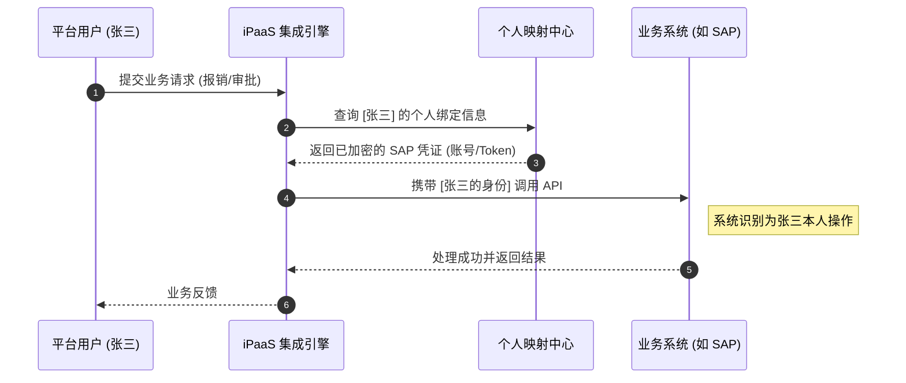

# 模拟身份认证：iPaaS 深度集成与身份透传全解析

## 1. 概述：为什么需要模拟身份认证？

在企业数字化转型过程中，iPaaS（集成平台即服务）连接了成百上千个业务系统。然而，API 调用不仅仅是两个服务器之间的“对话”，它往往代表了某个具体员工的业务行为。

**模拟身份认证（Simulated Identity Authentication）** 允许平台：
*   **透传真实身份**：让外部系统识别出操作是由哪位具体员工发起的。
*   **复用权限模型**：无需在平台侧重建复杂的权限逻辑，直接沿用 ERP/CRM 现有的 ACL。
*   **审计闭环**：在所有系统中保留一致的业务审计线索。

---

## 2. 核心认证逻辑流程

为了帮助您直观理解身份转换的过程，请参考以下逻辑图：

---

## 3. 应用场景与案例

为了应对多样化的集成需求，模拟身份认证支持从基础审计到复杂权限对齐的多种场景：

| 案例类型 | 核心价值 | 适用系统 |
| :--- | :--- | :--- |
| **财务审计闭环** | 真实记录单据创建人，满足合规审计。 | SAP, Oracle ERP, 金蝶/用友 |
| **数据越权控制** | 复用原系统的行级权限，防止数据泄露。 | Salesforce, CRM, 业务中台 |
| **员工自助服务** | 确保员工仅能操作本人数据，保障安全边界。 | HCM, OA, 钉钉/企微集成 |

### 3.1 典型案例：跨系统财务审计闭环
**场景**：某公司员工在移动端提交报销，后端需调用 SAP 接口。
**痛点**：若使用“系统级万能账号”调用，SAP 系统内所有记录的创建人都是“iPaaS_Admin”，无法区分真实业务人员。
**解决方案**：
1.  **管理员配置**：在集成系统设置中标记“用户名”字段为个人认证属性。
2.  **员工绑定**：员工首次使用时，在个人中心录入自己的 SAP 账号。
3.  **自动透传**：调用时，平台动态提取员工凭证并注入请求头。
**结果**：SAP 系统内每一笔报销单的“创建人”均自动填充为真实的报销人。

### 3.2 进阶案例：CRM 销售区域权限对齐
**场景**：某跨国公司的销售团队使用 iPaaS 构建的“商机管理”小程序。
**痛点**：公司规定销售 A 只能查看华东区客户，销售 B 只能查看华南区客户。如果使用统一的“集成账号”，小程序会面临严重的数据越权风险。
**解决方案**：
*   **身份映射**：每个销售在 iPaaS 绑定自己的 CRM 账号。
*   **权限透传**：iPaaS 在调用 CRM “查询客户”接口时，透传销售本人的身份。
**效果**：无需在 iPaaS 重复编写区域过滤逻辑，直接复用 CRM 原生的行级权限控制。

### 3.3 进阶案例：HR 自助服务安全边界
**场景**：员工通过企业微信修改个人公积金基数。
**痛点**：必须确保“员工甲”发起的请求，在 HR 系统中只能修改“员工甲”本人的记录，防止他人篡改。
**解决方案**：
*   **消费方用户映射**：通过 `__userName__` 提取企业微信的 UserID。
*   **模拟认证**：将 UserID 映射为 HR 系统的个人账号。
**效果**：实现“谁提交、谁鉴权、谁修改”的闭环，确保敏感 HR 数据操作的安全边界。

---

## 4. 实施配置指南

### 4.1 管理员：搭建认证框架 (集成系统)
管理员需先在后端完成协议定义：
1.  **设置分类**：将集成系统的认证分类选为 `模拟身份认证`。
2.  **标记字段**：在认证表单中，为需要用户录入的字段（如 `username`）添加约束 `personal_auth_flag:1`。

  
   <em>图 1：集成系统管理界面</em>

### 4.2 普通用户：激活个人配置 (个人集成映射)
用户只需一次性绑定，即可在所有编排流程中生效：
1.  **路径**：`接口平台 -> 基础管理 -> 个人集成映射配置`。
2.  **操作**：点击 **[绑定]** 并录入您的个人业务账号。

  
   <em>图 2：个人集成映射配置卡片</em>

---

## 5. 核心功能深度解析

### 5.1 提供方用户关系 (Provider Relation)
用于解决 **“我要去访问谁”** 的问题。
*   **同名映射**：集成平台用户 A $\rightarrow$ 提供方系统用户 A。
*   **不同名映射**：集成平台用户 A $\rightarrow$ 提供方系统用户 B。支持在后台手动维护映射表。

### 5.2 消费方用户关系 (Consumer Relation)
用于解决 **“谁在访问我”** 的问题。
*   **参数提取**：消费方（如 APP、第三方系统）在请求时携带参数（Query/Header/Body）。
*   **身份转换**：iPaaS 识别该参数，并将其转换为平台内部的一个合法用户身份，进而触发后续的模拟认证流程。

### 5.3 个人配置管理
管理员可以进入 `集成系统 -> 个人配置` 标签页，实时监控：
*   哪些用户已经完成了绑定。
*   绑定的凭证是否过期。
*   支持批量清理已离职员工的映射配置。

### 5.4 映射策略矩阵

| 策略方案 | 适用场景 | 维护成本 | 推荐指数 |
| :--- | :--- | :--- | :--- |
| **同名映射** | 平台用户名与外部系统完全一致。 | 极低（系统自动匹配） | ⭐⭐⭐⭐⭐ |
| **不同用户名映射** | 账号体系不一致，需手动建立关联。 | 中（需在后台录入映射关系） | ⭐⭐⭐ |
| **自定义参数映射** | 需通过 `__userName__` 动态从 Header/Body 提取。 | 灵活（需编写简单逻辑） | ⭐⭐⭐⭐ |

---

## 6. 安全性与可靠性建议

> [!IMPORTANT]
> **凭证保护**：平台采用高强度 AES 加密算法存储所有个人凭证，密钥分片存储，安全性极高。
> **权限最小化**：建议在外部系统中为个人账号分配“仅能完成该业务”的最小权限（如：仅查询权限或特定模块编辑权限）。
> **及时更新**：外部系统密码修改后，请务必前往“个人配置”页面执行【解绑】并【重新绑定】。

---

## 7. 常见问题 (FAQ)

> [!CAUTION]
> **Q：为什么我的系统列表中不显示“绑定”按钮？**
> A：请联系管理员检查集成系统的认证表单字段中是否正确配置了 `personal_auth_flag:1` 属性。

> [!NOTE]
> **Q：如果一个员工被调离岗，映射关系如何处理？**
> A：管理员可以在“集成系统-个人配置”中统一查看并解绑特定用户的配置，确保安全离场。

---

## 8. 结语

模拟身份认证不仅是一个技术功能，更是连接“技术集成”与“业务治理”的桥梁。通过遵循本指南的最佳实践，您可以构建更加安全、合规且符合业务逻辑的集成生态。
